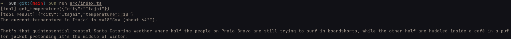

# Study: Tool Calling with LangChain + Gemini

A study project to understand how an LLM uses **tools** with [LangChain JS](https://js.langchain.com), running on [Bun](https://bun.com).

The model gets the question *"What's the temperature in Itajaí? Make a funny comment about it"*, realizes it doesn't know the temperature, asks to run the `get_temperature` tool, receives the result, and answers with the joke.



## Running

```bash
bun install
cp .env.example .env   # fill in GOOGLE_API_KEY
bun run src/index.ts
```

You can create an API key in [Google AI Studio](https://aistudio.google.com/apikey). Bun loads `.env` automatically.

## Structure

| File | Role |
|---|---|
| `src/get_temperature.ts` | Plain TypeScript function that fetches the temperature from [wttr.in](https://wttr.in). Knows nothing about LangChain. |
| `src/get_temperature_tool.ts` | Wraps the function as a *tool* with `tool()`, adding a name, description, and Zod schema. |
| `src/index.ts` | Creates the model, binds the tool, and implements the tool-calling loop. |
| `src/types.d.ts` | Minimal type for the wttr.in response. |

## Concepts

### What a tool is

A tool has two parts:

- **The function**, which runs on your machine. The model never executes code.
- **The metadata** (`name`, `description`, `schema`), which is sent to the model. The model uses it to decide *when* to call the tool and *which arguments* to pass. That's why the `description` matters so much.

### `bindTools` doesn't execute anything

`llm.bindTools([getTemperatureTool])` only tells the model which tools exist. When it wants to use one, it replies with an `AIMessage` containing `tool_calls`, something like:

```ts
[{ name: "get_temperature", args: { city: "Itajai" }, id: "..." }]
```

Running the tool and sending the result back is your code's job.

### The tool-calling loop

```
User   → model: "what's the temperature in Itajaí?"
model  → code:  "call get_temperature({ city: 'Itajai' })"
code runs the tool → '{"city":"Itajai","temperature":"18"}'
code   → model: [question + request + result]
model  → user:  "18°C in Itajaí... (joke)"
```

In `src/index.ts`, this is a `while` loop that keeps going as long as the model asks for tools:

```ts
let response = await llmWithTools.invoke(messages);
messages.push(response);

while (response.tool_calls?.length) {
  for (const call of response.tool_calls) {
    const toolMessage = await getTemperatureTool.invoke(call);
    messages.push(toolMessage);
  }

  response = await llmWithTools.invoke(messages);
  messages.push(response);
}
```

### Why push every message

The model **has no memory**: each `invoke` is an independent request. The `messages` array is the history, sent in full on every call.

| Step | `messages` |
|---|---|
| Start | `[Human]` |
| Model requests the tool | `[Human, AI(tool_calls)]` |
| Tool executed | `[Human, AI(tool_calls), Tool]` |
| Final answer | `[Human, AI(tool_calls), Tool, AI("18°C... joke")]` |

- The `AIMessage` with `tool_calls` must be in the history, because each `ToolMessage` has to follow the request that produced it.
- `getTemperatureTool.invoke(call)` takes the whole call and returns a `ToolMessage` with the same `id` as the request. That's how the model matches each result to the right request.
- The `while` exists because the model may ask for more tools after seeing a result, for example to compare two cities.

### Next step: agents

This manual loop is exactly what `createAgent` from the `langchain` package does under the hood:

```ts
import { createAgent } from "langchain";

const agent = createAgent({ model: llm, tools: [getTemperatureTool] });

const result = await agent.invoke({
  messages: [{ role: "user", content: "What's the temperature in Itajai?" }],
});
```

## Notes

- `temperature: 0.9` on the model controls how creative the answer is. It has nothing to do with the city's temperature.
- The tool schema uses Zod instead of raw JSON Schema. That way TypeScript infers the arguments (`{ city }`) and can type `tool.invoke(call)`.
